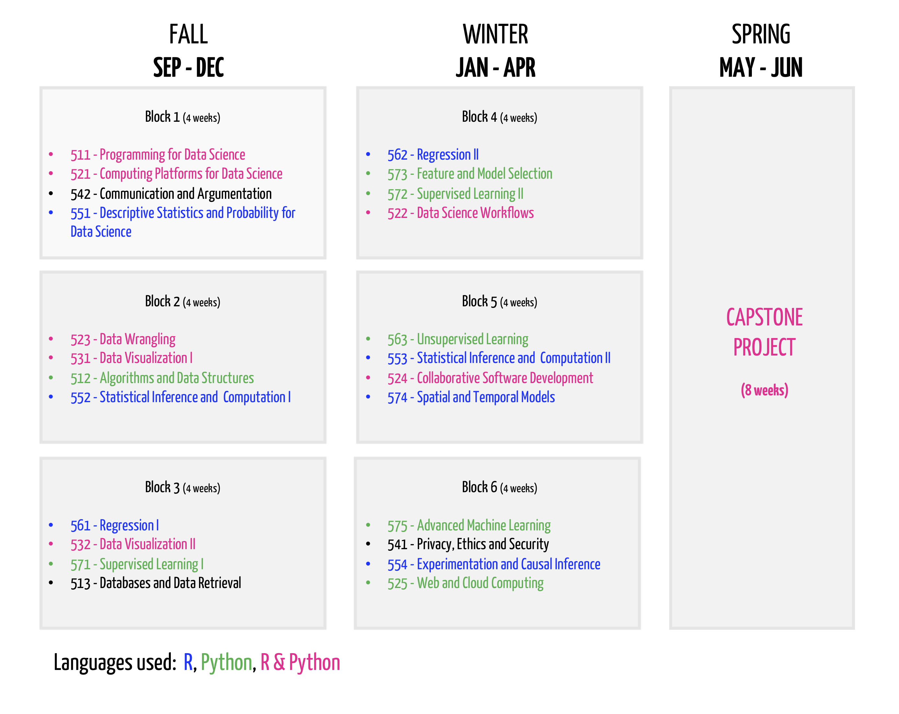
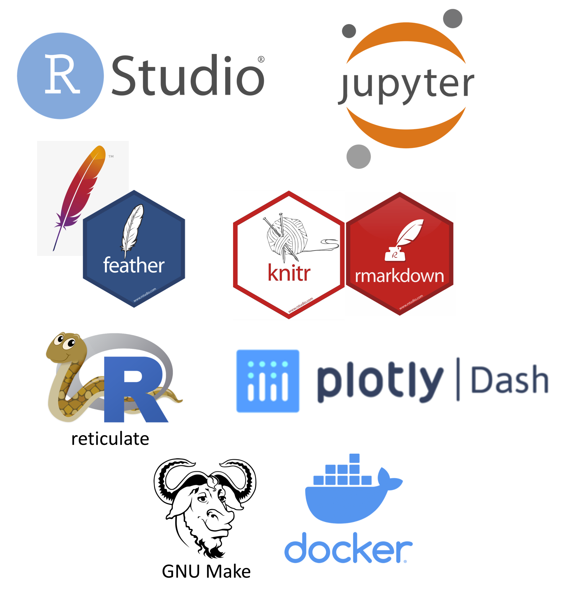
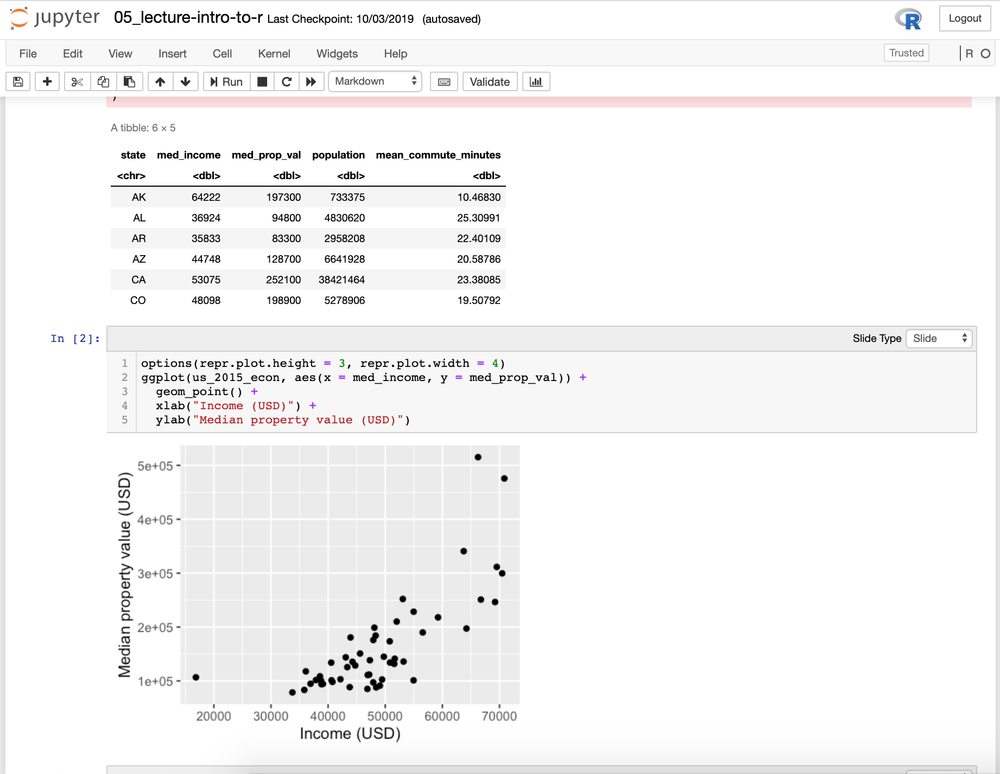
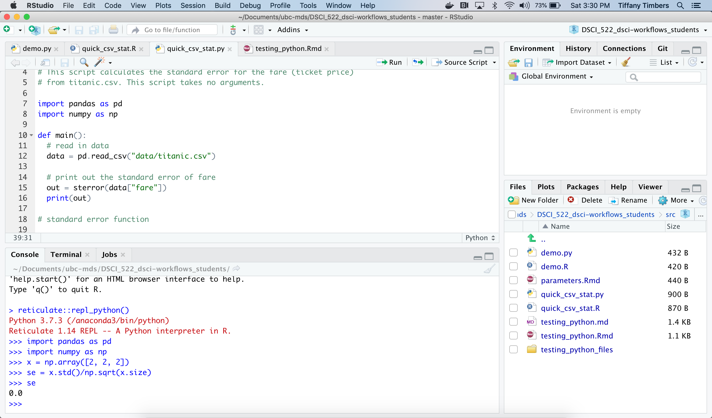
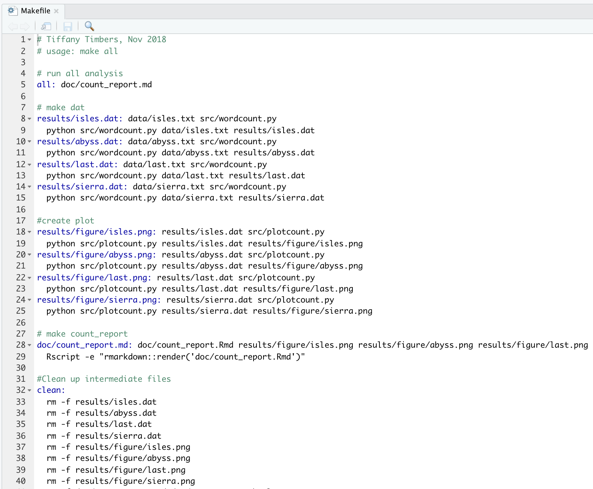
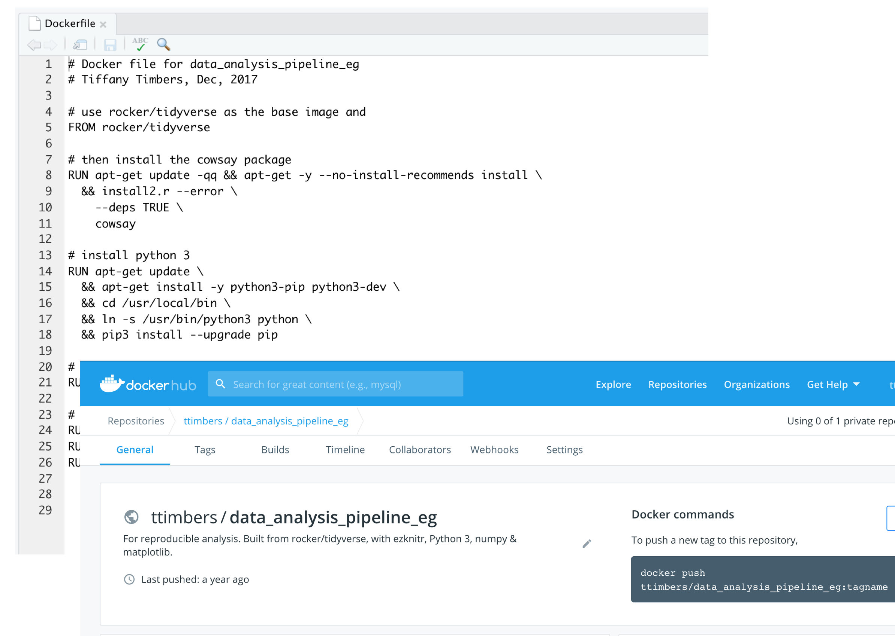

class: middle, center

---

class: middle

.pull-left[
## Tools we teach for R & Python harmony
* [RStudio](https://rstudio.com)
* [Jupyter](https://jupyter.org/)
* [knitr](https://yihui.org/knitr/) & [R Markdown](https://rmarkdown.rstudio.com/)
* [feather file format](https://blog.rstudio.com/2016/03/29/feather/)
* [reticulate](https://rstudio.github.io/reticulate/)
* [Make](https://the-turing-way.netlify.com/make/make.html)
* [Docker](https://www.docker.com/)
]

.pull-right[

]

---

## Example 1: R in Jupyter!

---

## Example 2: RStudio as a Python IDE!

---

## Example 3: GNU Make for polyglot automation!

---

## Example 4: Docker for polyglot reproducibility!

---